# Practica 4
# Diagrama Entidad Relacion:

### Aplicar servicio REST (aplicar por lo menos 2 métodos del CRUD) basado en la entidad transaccional asignada en su trabajo autónomo.
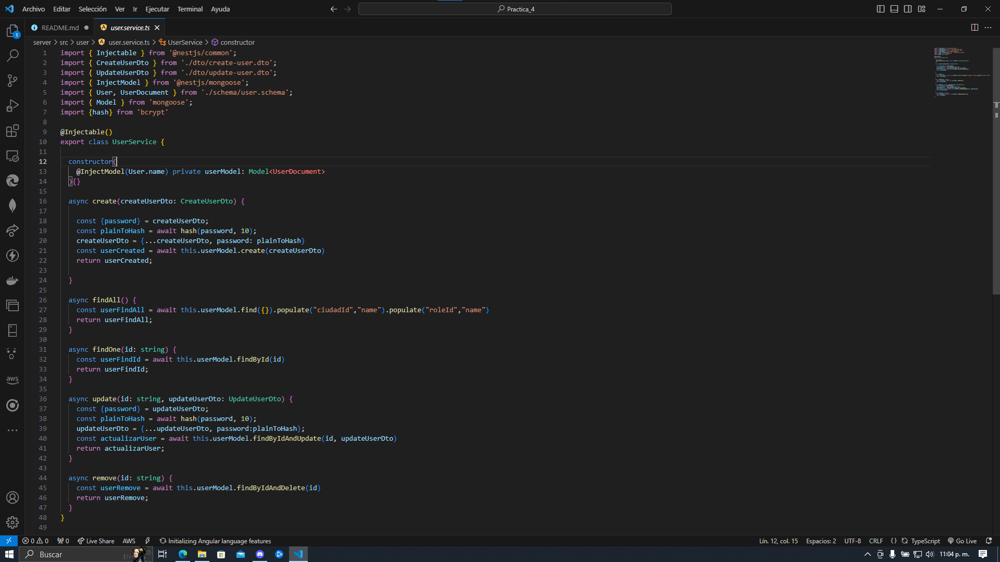

### Instalar minikube sobre Docker https://minikube.sigs.k8s.io/docs/start/
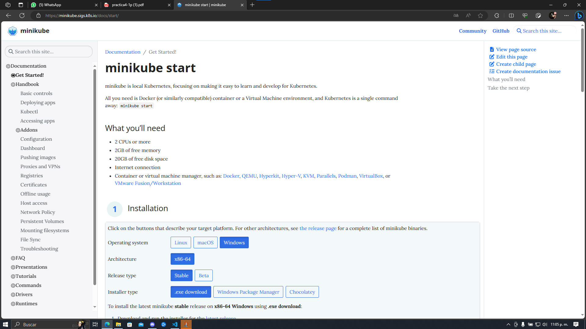

### Definir configuraciones y secretos para los parámetros de su base de datos y servicio REST.
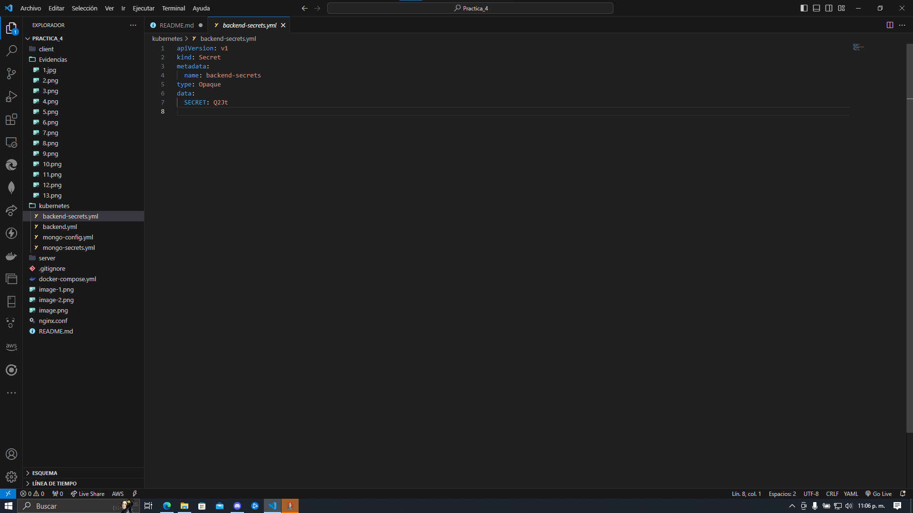
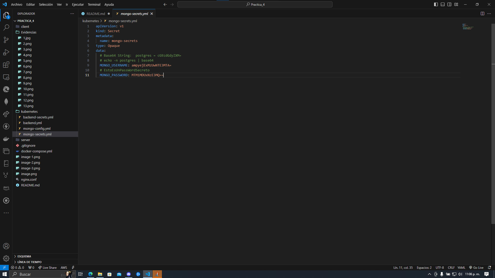
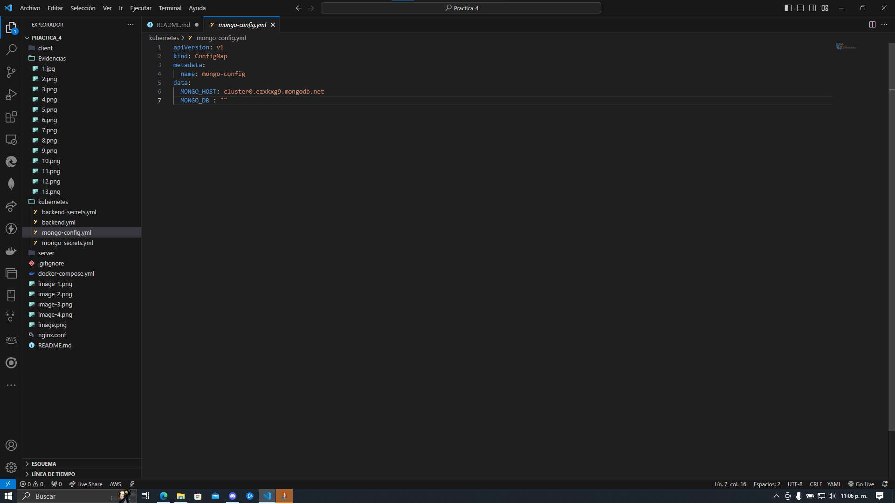

### Definir el Deployment y el Service para levantar su servicio REST y Base de Datos.
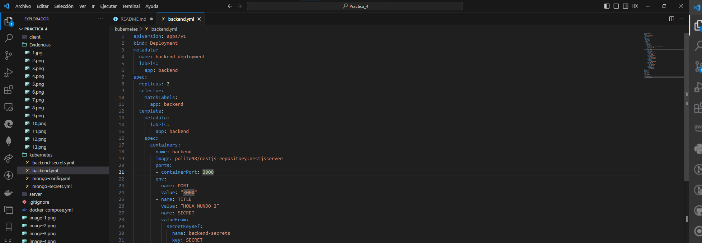
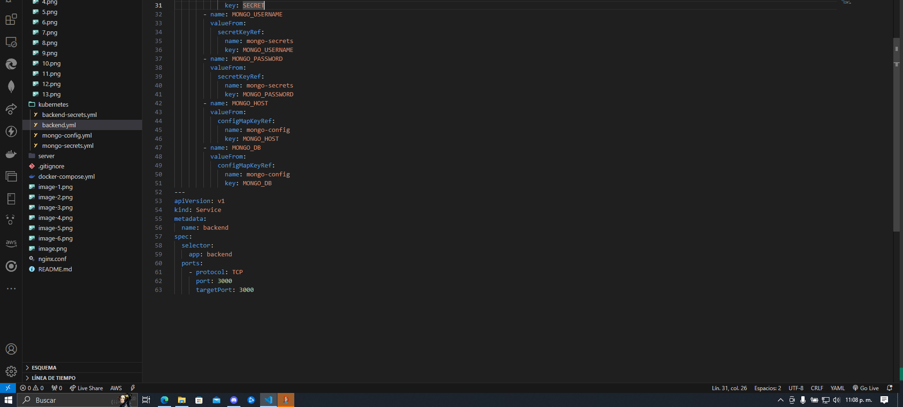

### Aplicar los siguientes comandos para aplicar su configuración con minikube:

#### kubectl apply -f [file-name].yml para aplicar un archivo específico a la configuración
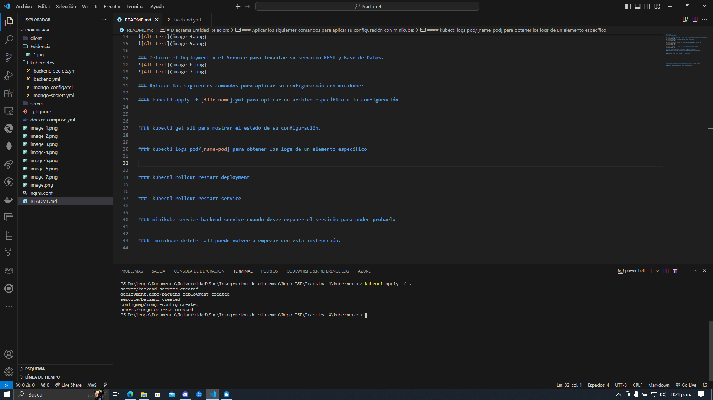

#### kubectl get all para mostrar el estado de su configuración.
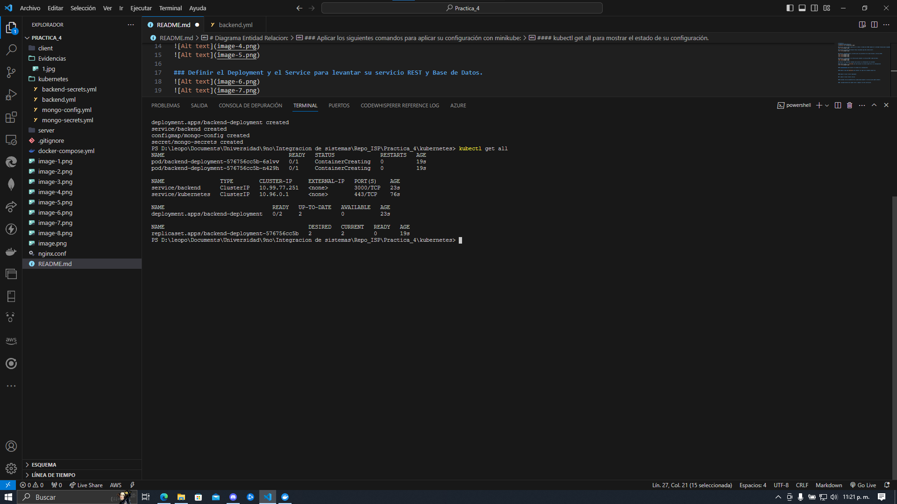

#### kubectl logs pod/[name-pod] para obtener los logs de un elemento específico
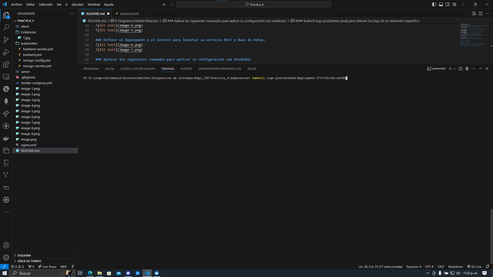
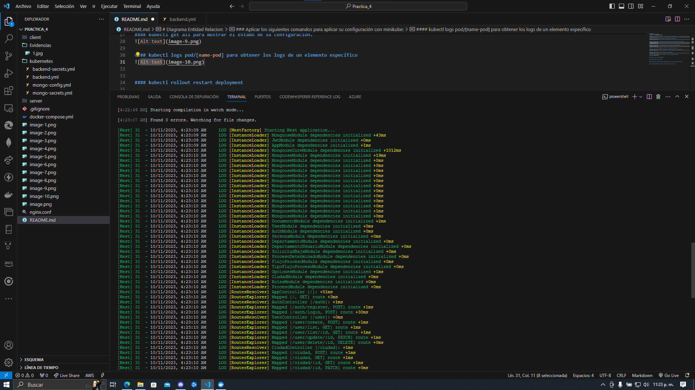

#### kubectl rollout restart deployment
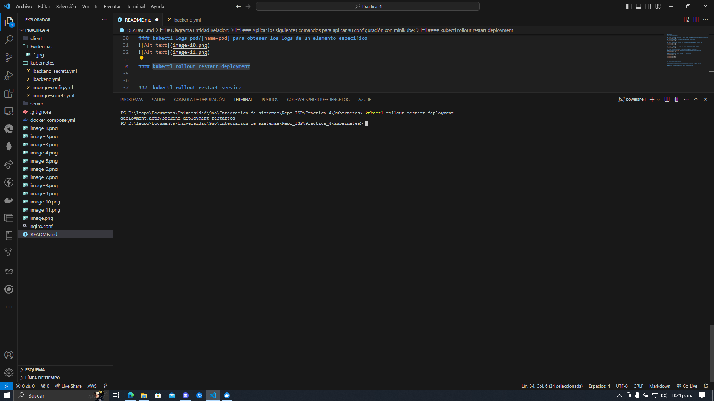

###  kubectl rollout restart service
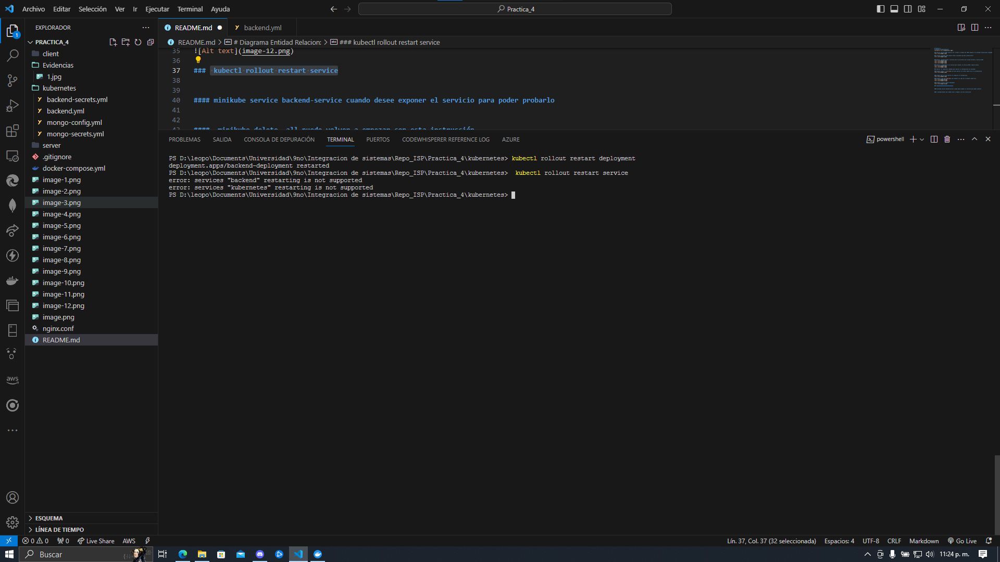

#### minikube service backend-service cuando desee exponer el servicio para poder probarlo
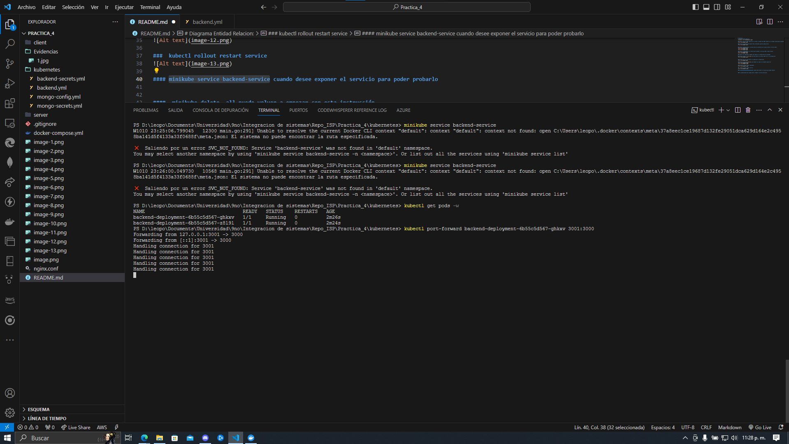
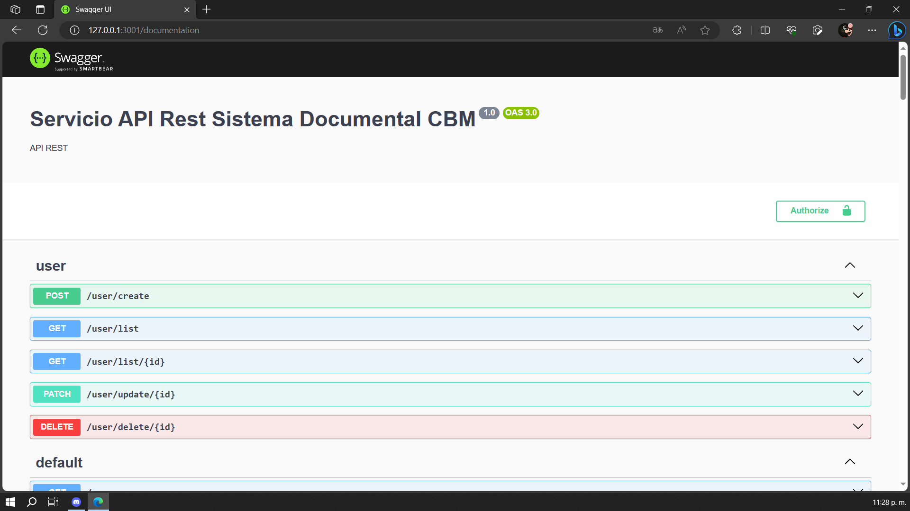
